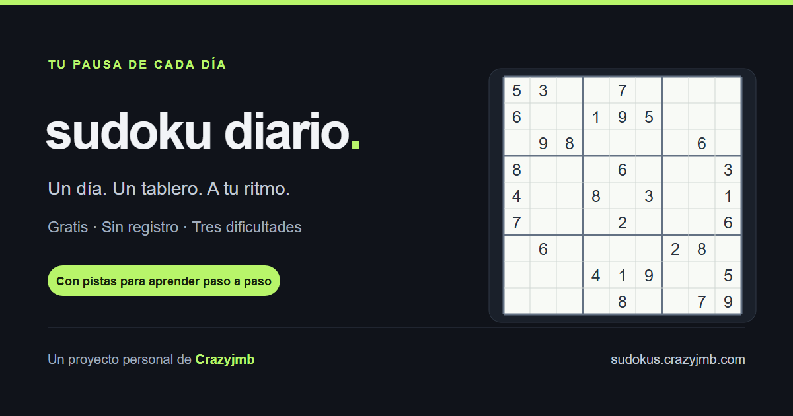

# Sudoku diario

**Un día. Un tablero. A tu ritmo.** Un proyecto personal de [Crazyjmb](https://crazyjmb.com/) para jugar al sudoku online, sin cuentas y con el progreso guardado en tu navegador.

[Jugar al sudoku](https://sudokus.crazyjmb.com/) · [Portfolio de Crazyjmb](https://crazyjmb.com/) · [Documentación técnica](docs/TECHNICAL.md)



## Qué puedes hacer

- Jugar un sudoku nuevo cada día en dificultad **fácil, media o difícil**, siempre con una única solución.
- Escribir notas, borrar y deshacer con teclado o controles táctiles.
- Activar las ayudas que prefieras. Por defecto se juega en **difícil y sin ayudas visuales**.
- Pedir pistas razonadas que orientan antes de revelar una respuesta.
- Consultar el historial, continuar partidas anteriores y mantener una racha diaria.
- Exportar e importar partidas, notas y preferencias entre dispositivos.
- Introducir otro sudoku a mano o desde una foto para recibir pistas paso a paso.

La misma fecha y dificultad producen el mismo tablero. La generación y la validación se ejecutan en un Web Worker para mantener la interfaz disponible.

## Tecnologías

Vue 3 · TypeScript · Vite · Pinia · Tailwind CSS 4 · shadcn-vue / Reka UI · Tesseract.js · Vitest · Playwright.

Es una aplicación estática: no necesita servidor de API, base de datos, cuentas ni claves de servicios.

## Ejecutar en local

Necesitas **Node.js 24** (versión indicada en `.nvmrc`) y npm. También se admite Node.js 22.12 o superior dentro de la rama 22.

Clona el repositorio o descarga su código y, desde la carpeta del proyecto, ejecuta:

```sh
npm ci
npm run dev
```

Abre **http://localhost:4173**. No hace falta crear un archivo `.env`.

## Comandos

| Comando | Para qué sirve |
| --- | --- |
| `npm run dev` | Servidor de desarrollo en el puerto 4173. |
| `npm run typecheck` | Comprobación de TypeScript y componentes Vue. |
| `npm test` | Pruebas unitarias y de renderizado con Vitest. |
| `npm run build` | Comprueba tipos y genera la web en `dist/`. |
| `npm run preview` | Sirve la compilación localmente; usa la URL que muestra Vite. |
| `npm run test:e2e` | Compila y prueba los flujos reales en Chromium, en el puerto 4174. |
| `npm run seo:image` | Regenera la imagen social; requiere Chromium de Playwright. |

Para instalar el navegador y ejecutar las pruebas completas:

```sh
npx playwright install chromium
npm test
npm run test:e2e
```

En Linux, `npx playwright install --with-deps chromium` instala también las dependencias del sistema. La suite incluye generación y unicidad, guardado, rachas, importaciones, controles, pistas, vista móvil, SEO y OCR. La prueba de OCR real necesita conexión a jsDelivr. Los informes y capturas se generan localmente y no se versionan.

El workflow de [GitHub Actions](.github/workflows/ci.yml) comprueba tests y compilación con Node.js 22 y 24, y ejecuta Playwright con Node.js 24. No publica la web.

## Controles

| Acción | Tecla |
| --- | --- |
| Escribir un número | `1`–`9` |
| Mover la selección | Flechas |
| Activar o desactivar notas | `N` |
| Borrar | `Supr`, `Retroceso` o `0` |
| Deshacer | `Ctrl+Z` / `Cmd+Z` |

Resolver el sudoku de hoy durante hoy suma un día a la racha. Resolver uno antiguo lo añade al historial, pero no recupera días de racha.

## Datos y fotos

Las partidas y preferencias se guardan en `localStorage`, por navegador y origen. No hay sincronización automática: utiliza la exportación/importación de Configuración para trasladar tu progreso.

Las fotos se procesan en el navegador y no se envían a un servidor de reconocimiento. Tesseract.js descarga desde jsDelivr el worker, el motor WebAssembly y el modelo al usar OCR, por lo que la primera lectura requiere internet. La foto no se guarda; se conservan los números reconocidos y su estado de revisión. Revisa siempre la lectura antes de pedir pistas.

Actualmente no se incluye Google Analytics. El OCR se ha probado con un sudoku impreso en Chromium; su precisión depende de la imagen y no se ha validado con todas las cámaras y fotografías posibles.

## Publicar tu propia instancia

```sh
npm ci
npm run build
```

Sirve **el contenido de `dist/`** desde un hosting estático por HTTP/HTTPS. No necesitas subir `node_modules` y no debes abrir la aplicación con `file://`.

El dominio oficial es `https://sudokus.crazyjmb.com/`. Si publicas una copia en otro dominio, adapta el canónico, el sitemap, robots y la imagen social siguiendo [SEO.md](SEO.md). Los assets usan rutas relativas; las vistas `#configuracion` y `#resolver` no requieren reglas de reescritura.

## Documentación y contribuciones

- [Documentación técnica](docs/TECHNICAL.md): generador, dificultades, pistas, rachas, persistencia y OCR.
- [SEO y publicación web](SEO.md): metadatos, sitemap y Search Console.
- [Contribuir](CONTRIBUTING.md): desarrollo, pruebas y criterios para proponer cambios.
- [Publicar el repositorio en GitHub](docs/GITHUB.md): pasos para el mantenedor.
- [Seguridad](SECURITY.md): cómo comunicar una vulnerabilidad.

Puedes comunicar errores y proponer mejoras en Issues. Para cambios amplios, describe primero la propuesta. Conserva la compatibilidad de los tableros y guardados existentes.

## Autor y licencia

Creado por **[Crazyjmb](https://crazyjmb.com/)** como proyecto personal.

El código propio se distribuye bajo **[PolyForm Noncommercial 1.0.0](LICENSE)**: permite usar, modificar y distribuir para los fines no comerciales contemplados en la licencia, conservando sus términos y los avisos requeridos de [NOTICE](NOTICE). Los usos comerciales requieren autorización expresa de Crazyjmb.

Es código público con restricción de uso comercial; no se presenta como software de código abierto sin restricciones de uso. Los componentes y dependencias de terceros mantienen sus licencias originales, recogidas en [THIRD_PARTY_NOTICES.md](THIRD_PARTY_NOTICES.md).
